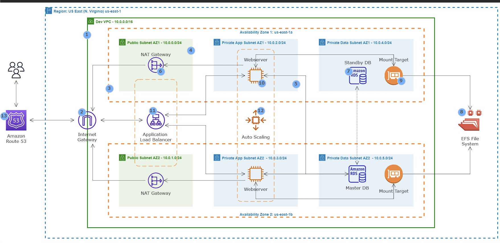

# Capstone Project-WordPress Site on AWS

## Evaluation Report for the Capstone Project: WordPress Site on AWS

Project Overview Diagram:

1. VPC SETUP

### Objective: Isolate and secure the WordPress infrastructure within a VPC.

Steps:

- Defining an IP Address Range for the VPC and create the VPC.
- Creating Public and Private Subnets across different Availability Zones for redundancy.
- Creating Internet Gateway (IGW):
- Providing a name for the Internet Gateway and attach it to the VPC.
- Creating a NAT Gateway, Choose the private subnet for the NAT Gateway and allocate an Elastic IP and create the NAT Gateway.
- Route Tables Configuration, Associate the public subnets with a route table that routes traffic to the IGW.
- Associate the private subnets with a route table that routes traffic to the NAT Gateway.

See image bellow show the VPC resource map for the internet connectivities:

2. BASTION HOST SETUP

### Objective: Setting up a secure access point to SSH into private EC2 instances.

Steps:

- Creating a Security Group for the Bastion Host allowing inbound SSH (port 22) from the IP address.
- Launching the Bastion Host in a public subnet using Amazon Linux 2 AMI.
- SSH into the Bastion Host from a terminal to securely access private instances.
 
 The images below shows how the bastion host was login successfully and how the private instance was accessed securely.

3. WORDPRESS EC2 INSTANCE SETUP

### Objective: Deploying WordPress on a private EC2 instance.

- Creating a Security Group for WordPress allowing SSH, HTTP, and HTTPS access.
- Launching the EC2 Instance for WordPress in the private subnet with the necessary security group.
- Installing Apache, MySQL, WordPress and PHP on the EC2 instance.

Image shows how apached was installed on my wordpress EC2 instance:

4. AWS EFS SETUP

### Objective: Utilizing Amazon EFS for scalable and shared storage for WordPress files.

Steps: 

- Creating security group for EFS, ensuring that port 2049 (NFS) is opened, and allowing the worpress security group.
- Creating an EFS File System and ensure to attach the EFS security group and also attaching it to VPC (In private subnet).
- Installing NFS client on my EC2 instance, Creating Mount Targets in each private subnet for access.
- Mounting EFS to the WordPress EC2 instances for shared file storage.

Image below shows how the EFS was mounted to the Wordpress EC2 instance:

5. AWS RDS SETUP

### Objective: Deploying a managed MySQL database using Amazon RDS for WordPress data storage.

Steps:

- Creating a Security Group for the RDS instance allowing inbound traffic on MySQL port 3306 from the WordPress EC2 instances.
- Launching MySQL RDS Instance with appropriate configuration, such as storage and instance class.
- After creation the following are noted: RDS endpoint, default username and default password.
- Login with the default admin user above with the endpoint is the hostname. creating a database named (wordpress).
- Granting access to the database, and flushing privileges.

See below image:

6. CONNNECTING TO WORDPRESS TO RDS

Steps:

- Renaming the default wp-config-sample.php to wp-config.php.
- Editing the wp-config.php file with the database details from the RDS instance (DB name, username, password, and host).
- Saving the file and restarting the web service.

7. SETTING UP A LOAD BALANCER (LB)

Since the wordpress is in the private subnet, I wont be able to access it using the public ip of the instance, Hence the need for Load Balancer.
Before setting up a load balancer, I will first create a Target Group which the Load Balancer will route traffic to, Our target group port wil be HTTP,
ALB facing internet, and placed in a public subnet.

After all this has been put in place, I was able to access the wordpress site through the LB DNS name, See images below.

